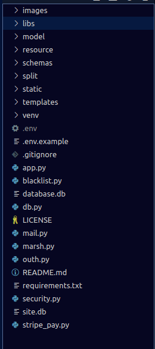
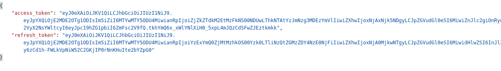
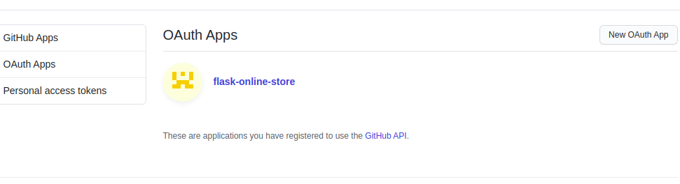
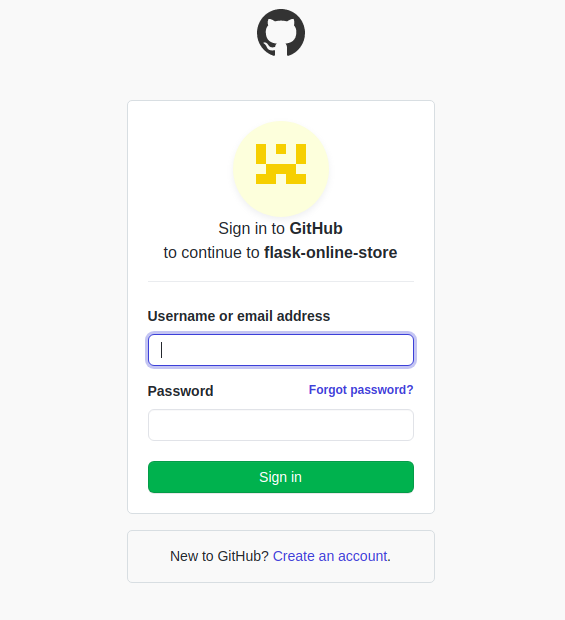
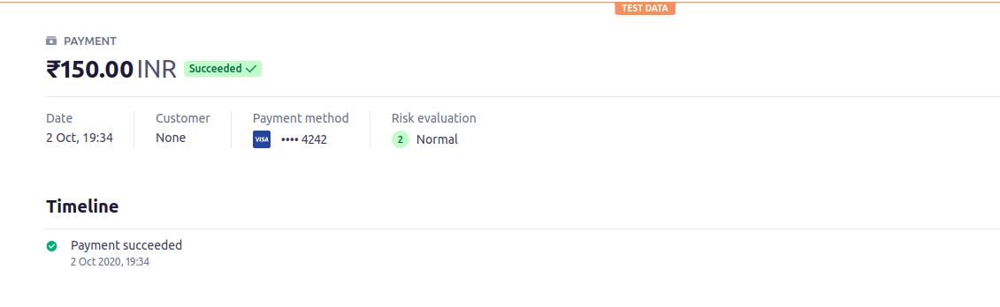

# Flask Online Store

### About the Project :open_book:

- API built using flask a simple project 
- This is a simple API you can use as a guide for you flask projects
- The api comes with a bunch of functionalities
- The api is being upgraded with more features which I plan to work on, you can checkout [issues here](https://github.com/DiptoChakrabarty/online-store/issues) 
- Different functionalities and modules used are listed below
- Here are the [API Docs](https://web.postman.co/collections/11841253-1633252c-79ac-4fe4-a42d-1447180ebc25?version=latest&workspace=5573babf-db99-44c9-8b27-4df43388e0cb)  they are being further updated
- If you like the project please do :star: it :innocent:


### How to run the project  :horse_racing:

 ##### To run locally 
```sh
* Clone the repository 
 git clone https://github.com/DiptoChakrabarty/flask-online-store.git

* Enter directory 
 cd flask-online-store

* Activate virtual environment
  source venv/bin/activate

* Install packages
  pip3 install -r requirements.txt

* Set environment variables
 cp .env.example .env

* Fill the parameters

  CLIENT_ID= {Github Client Id}
  CILENT_SECRET= {Github Client Secret}
  STRIPE_API= {Stripe token}
  MAIL_USERNAME = {Email Id }
  MAIL_PASSWORD = {Email Password}

* Remove site.db to start from fresh database
  rm site.db

* Start app
  python3 app.py

* Head over to http://localhost:5000
  (it is preferable if you use something as postman as most are post requests)


```

##### To run in docker
```sh
 * Set environment variables
   cp .env.example .env

* Fill the required parameters

* If you have removed site.db then remove the following line in Dockerfile
  RUN rm site.db

* Run using 
  docker-compose up -d to start as background process

* Head over to http://localhost:5000

```

## Repository Structure :deciduous_tree:

 

Based on the directories present

* Model directory contains all the database model class and methods associated
 
* Resource directory contains api resource classes 

* Schemas is for the marshmallow schemas 

* Split contains sample code which can help you understand the code base

* Static is the directory where user images are uploaded

* Templates conatins html templates


## DataBase Architecture :desktop_computer:
```sh

There are mainly four schemas 

* Users - which contains details about the users
* Store - which contains details about the store
* Items - which contains details about the items
* Order - which is for ordering stuff

### DataBase Architecture

- store and item : one to many 
- item and order: many to many 


```

## Functionalities present

### 1) flask_jwt_extended
  - [Read about it here](https://flask-jwt-extended.readthedocs.io/en/stable/)

  - flask jwt extended allows us to generate access and refresh tokens
  ```sh
        access_token = create_access_token(identity=user.id,fresh=True)
        refresh_token = create_refresh_token(user.id)

        return {
            "access_token": access_token,
            "refresh_token": refresh_token
        },200
   ```
    
  - For all post and put methods jwt token is required

  - Deletion requires a fresh jwt token so might prompt you to sign in again
  


### 2) flask restful
   - [Read about it here](https://flask-restful.readthedocs.io/en/latest/)

   - Used for creating resource class

   - You can define the endpoints using flask restful
   ```sh
    class Item(Resource):
    
      def get(self):
          try:
              data = item_schema.load(request.get_json())
              print(data.name)
          except ValidationError as err:
              return err.messages,400
          print(data)
          name = data.name
          item = ItemModel.find_by_name(name)

          if item:
              return item_schema.dump(item)
          return {
              "msg": "Item not found"
          }
   ```

### 3) flask marshmallow
  - [Read about it here](https://flask-marshmallow.readthedocs.io/en/latest/)

  - flask marshmallow allows us to easily seralize and desarlize data 

  - Check marsh_app.py file under split directory which contains simple example of using flask marshmallow
  
   ```sh
        class RewardSchema(ma.SQLAlchemyAutoSchema):
            class Meta:
                model = Reward
                load_instance = True

        class MarshSchema(ma.SQLAlchemyAutoSchema):
            rewards = ma.Nested(RewardSchema,many=True)
            class Meta:
                model = Marsh
                load_instance = True

   ```
   
  - The example used above has been similarly implemented in the project

  - flask marshmallow latest version has syantax  different from previous versions 

  - marshamllow integrates well with SQLAlchemy 

### 4) OAuth2
   - [Read about it here](https://flask-oauthlib.readthedocs.io/en/latest/client.html)

   - For OAuth we are now using GitHub 

   - The relevant methods are in github_login file in resource directory 

   - Go to Github -> Settings -> Developer settings -> OAuth Apps and get your own client id and secret

   

   - Populate those values in .env to use github oauth
  

### 5) flask migrate 
   - [Read about it here](https://flask-migrate.readthedocs.io/en/latest/)

   - flask migrate can be used to migrate the database easily 

   - app.py under split folder contains sample code 

   ```sh
    Command used for migration 

      flask db migrate 

      This does the initial migration and creates the relevant files 

      flask db upgrade 

      This finally upgrades your database

   Command used for downgrade

      flask db downgrade
    
  ```

### 6) flask mail 
  - [Read about it here](https://pythonhosted.org/Flask-Mail/)

  - flask mail allows us to integrate mailing service with flask easily

  - Check mail.py file under split directory which contains simple example to use flask mail
  
  ```sh
        msg= Message("Confirm Email",recipients=[email])
        link = url_for("token_verify",token=tok,_external=True)
        msg.body = "Verify email address by clicking here {}".format(link)
        mail.send(msg)
  ```
  
  - This is used for user confirmation during signup 

### 7) Stripe
   - [Read about it here](https://stripe.com/docs)

   - Payments using stripe is integrated within the app

   - Create an account in  stripe and generate stripe api keys and add the secret key in .env

   - Test token to make payements is generated using the function 

   ```sh

    token=stripe.Token.create(
        card={
            "number": "4242424242424242",
            "exp_month": 9,
            "exp_year": 2021,
            "cvc": "314",
            }, )
     The values given here are all sample values 
   ```

   - For performing Indian payments we have to provide the following parameters
   ```sh
    stripe.Charge.create(
              amount=self.amount,
              currency=CURRENCY,
              description=self.description,
              source=token["id"],
              shipping={
                'name': "John",
                'address': {
                'line1': '510 Townsend St',
                'postal_code': '98140',
                'city': 'Kolkata',
                'state': 'WB',
                'country': 'India',
            }
        })
   ``` 

   - If you check you payments page in stripe dashboard you should receive fake payments
    

## Contribution Guidelines  🙂

When contributing to this repository, please first discuss the change you wish to make via issue, email, or any other method with the owners of this repository before making a change.

If anyone wants to take up an issuse they are free to do so .


## Pull Request Process

* Ensure any install or build dependencies are removed before the end of the layer when doing a build.
* Update the README.md with details of changes to the interface, this includes new environment variables, exposed ports, useful file locations and container parameters.
* Only send your pull requests to the development branch where once we reach a stable point it will be merged with the master branch .
* Associate each Pull Request with the required issue number.
* Please provide relevant steps to use your codebase adding few extra lines of comments or commands to run would be helpful for others to follow along .

## Branch Policy
- development: If you are making a contribution make sure to send your Pull Request to this branch . All developments goes in this branch.

- master: After significant features/bug-fixes are accumulated in development branch we merge it with the master branch.

## Contribution Practices

- Please be respectful of others , do not indulge in unacceptable behaviour 
- If a person is working or has been assigned an issue and you want to work on it please ask him/her if he is working on it
- We are happy to allow you to work on your issues , but in case of long period of inactivity  the issue will be approved to another volunteer
- If you report a bug please provide steps to reproduce the bug.
- In case of changing the backend routes please submit an updated routes documentation for the same.
- If there is an UI related change it would be great if you could attach a screenshot with the resultant changes so it is easier to review for the maintainers

